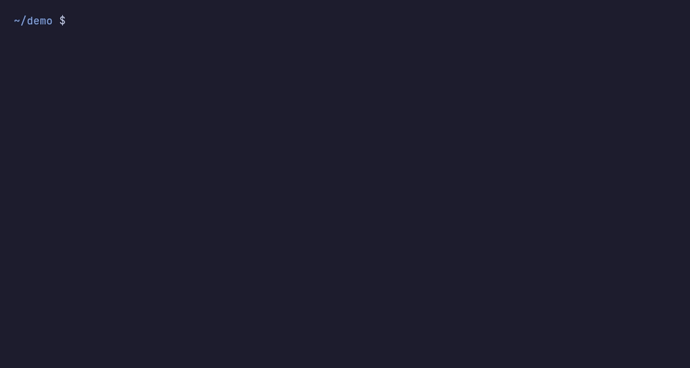

<h1 align="center">ShellQ</h1>

<p align="center"><b>Get shell commands, fixes and answers from AI without leaving zsh.</b></p>

<p align="center">
  
  
  
  
  
</p>

<p align="center">
  
  <br><sub>Recorded live at real speed.</sub>
</p>

ShellQ adds AI to your zsh prompt. Press <kbd>Ctrl</kbd>+<kbd>O</kbd> to **turn plain English into a command**, **fix the one that just failed**, or **ask a question**, without opening another app like Claude Code or Codex. It works with the Codex CLI signed in with your **ChatGPT subscription** or an **OpenAI API key**, or with a **local model** you already run.

> [!IMPORTANT]
> **Nothing runs without you.** Suggested commands land in your prompt for you to edit or run. ShellQ never executes them.

---

## TL;DR

Press <kbd>Ctrl</kbd>+<kbd>O</kbd> and a compact panel opens under your prompt. Type a task for ranked commands, press it after a failure for a fix, or press it on an empty line to ask.

## 80/20

- **One key, three modes.** <kbd>Ctrl</kbd>+<kbd>O</kbd> picks Ask, Command or Fix from what is on your prompt; <kbd>Tab</kbd> switches.
- **Options you can judge.** Command and Fix return three ranked approaches, each with a **risk level**, a **model-estimated confidence**, an impact line and a short explanation.
- **Bring your own model.** Your signed-in Codex CLI, or a local OpenAI-compatible server on `127.0.0.1`. ShellQ never installs or starts one.
- **One command to install.** Homebrew on macOS, a script on Linux. It all loads from one `source` line in `~/.zshrc`. Works over ssh.

## Features

| Mode | How to open | What you get | Safety |
| :-- | :-- | :-- | :-- |
| **Ask** | <kbd>Ctrl</kbd>+<kbd>O</kbd> on an empty prompt | An answer in the terminal; with Codex, a resumable chat per directory | Display-only |
| **Command** | Type a task, then <kbd>Ctrl</kbd>+<kbd>O</kbd> | Three ranked commands with risk, confidence and a short explanation | Inserted for review, never run |
| **Fix** | <kbd>Ctrl</kbd>+<kbd>O</kbd> after a command fails | Ranked fixes that read the failed command's output | Inserted for review, never run |

---

## Quick start

**Needs** an authenticated [`codex`](https://github.com/openai/codex) CLI or a local OpenAI-compatible server.

**macOS**

```zsh
brew install jsonmartin/shellq/shellq
```

Add the `source` line it prints to the end of `~/.zshrc`. Homebrew installs Bun and `jq` for you.

**Linux**

```sh
curl -fsSL https://raw.githubusercontent.com/jsonMartin/shellq/main/install.sh | sh
```

The script clones ShellQ to `~/.local/share/shellq`, runs `bun install` and adds the `source` line to `~/.zshrc`. It needs git, zsh, `jq` and [Bun](https://bun.sh) first. Rerun it to update.

Other ways on Linux:

- **Homebrew on Linux** (untested): `brew install jsonmartin/shellq/shellq`.
- **Arch, x86_64:** download `shellq-*-x86_64.pkg.tar.zst` from [Releases](https://github.com/jsonMartin/shellq/releases), then run `sudo pacman -U ./shellq-*-x86_64.pkg.tar.zst`.
- **AUR:** coming. Arch closed new AUR account sign-ups in June 2026 after a malware wave, so ShellQ can't be published there yet. It goes up as soon as sign-ups reopen.

**From source, anywhere**

```zsh
git clone https://github.com/jsonMartin/shellq.git
cd shellq && bun install
source shellq.plugin.zsh
```

Needs zsh, `jq` and Bun (tested with 1.3.3 and 1.4.2).

**Then open a new shell and press <kbd>Ctrl</kbd>+<kbd>O</kbd>.** <kbd>Esc</kbd> cancels a request or closes the panel.

> [!NOTE]
> Beta, tested on Linux and macOS. See **Known limits** below.

---

## Details

Open the section you need.

<details>
<summary><b>Install for good, update, remove</b> · one line in <code>~/.zshrc</code></summary>

**Keep it loaded.** Homebrew, the install script and the Arch package tell you
the line to use. From source, add one line to the end of `~/.zshrc`, using your
checkout's absolute path:

```zsh
source '/absolute/path/to/shellq/shellq.plugin.zsh'
```

Then open a new shell or run `source ~/.zshrc`.

**Plugin managers.** `shellq.plugin.zsh` sits at the repository root, so antidote
(`jsonMartin/shellq`), zinit and Oh My Zsh custom plugins can load it. Run
`bun install` once in the cloned directory first.

**Update.** Homebrew: `brew upgrade shellq`. Install script: rerun it. Arch
package: install the new release's package. From source: pull the default
branch, rerun `bun install` in the checkout. Then start a new shell.

**Remove**, in order:

1. Delete the `source …/shellq.plugin.zsh` line from `~/.zshrc`.
2. Exit every shell that loaded the plugin. Those shells can still open the
   panel until they exit.
3. Uninstall: `brew uninstall shellq`, `sudo pacman -R shellq`, or delete the
   checkout (`~/.local/share/shellq` for the install script).
4. Optionally delete the state directory: `$SHELLQ_STATE_DIR` (must be
   absolute), else `$XDG_STATE_HOME/shellq` (if absolute), else
   `~/.local/state/shellq`. It holds `settings.json`, per-directory Ask
   pointers and ShellQ's private Codex history. Do not delete `~/.codex` or
   `~/.claude`; those belong to your CLIs.

</details>

<details>
<summary><b>Keyboard shortcuts</b> · everything has a key</summary>

| Key | Action |
| --- | --- |
| <kbd>Ctrl</kbd>+<kbd>O</kbd> | Open: Ask (empty prompt), Command (typed text), Fix (after a failure) |
| <kbd>Tab</kbd> / <kbd>Shift</kbd>+<kbd>Tab</kbd> | Switch mode |
| <kbd>Enter</kbd> / <kbd>Shift</kbd>+<kbd>Enter</kbd> | Submit / new line |
| <kbd>↑</kbd> <kbd>↓</kbd> | Choose a result, or scroll Ask when the composer is empty |
| <kbd>PageUp</kbd> <kbd>PageDown</kbd>, wheel | Scroll explanations and Ask |
| <kbd>Esc</kbd> | Cancel the running request, go back, or close |
| <kbd>Ctrl</kbd>+<kbd>X</kbd> <kbd>S</kbd> or <kbd>Ctrl</kbd>+<kbd>K</kbd> | Settings: model, effort, provider, Initial choices, more |
| <kbd>Ctrl</kbd>+<kbd>X</kbd> <kbd>M</kbd> / <kbd>R</kbd> / <kbd>G</kbd> | Settings scoped to model / effort / Ask engine |
| <kbd>Ctrl</kbd>+<kbd>X</kbd> <kbd>P</kbd> | Provider Setup |
| <kbd>Ctrl</kbd>+<kbd>X</kbd> <kbd>A</kbd> | Ask for another suggestion (up to five) |
| <kbd>Ctrl</kbd>+<kbd>X</kbd> <kbd>E</kbd> → <kbd>Ctrl</kbd>+<kbd>X</kbd> <kbd>W</kbd> | Edit the prompt or a suggestion, then save |
| <kbd>Ctrl</kbd>+<kbd>X</kbd> <kbd>I</kbd> | Attach or hold back the last command's output |
| <kbd>Ctrl</kbd>+<kbd>X</kbd> <kbd>H</kbd> | Details: last command, exit codes, context, model, risk |
| <kbd>Ctrl</kbd>+<kbd>X</kbd> <kbd>D</kbd> | Doctor: local checks only (cwd, provider, settings, Ask pointer) |
| <kbd>Ctrl</kbd>+<kbd>X</kbd> <kbd>N</kbd> | New Ask chat |
| <kbd>Ctrl</kbd>+<kbd>X</kbd> <kbd>C</kbd> | Edit the attached context |
| <kbd>Ctrl</kbd>+<kbd>T</kbd> | Local models: thinking on/off for the next request |

The mouse is optional. Clicks select, scroll and open menus. They never insert,
submit or cancel.

</details>

<details>
<summary><b>Results</b> · ranking, risk, confidence and editing</summary>

- Command and Fix request three distinct approaches by default and rank them
  by the model's confidence. Set 1–5 under **Settings → Initial choices**.
  <kbd>Ctrl</kbd>+<kbd>X</kbd> <kbd>A</kbd> adds one more, up to five.
- Confidence is the model's estimate, not a measured success rate. It shows
  green at 90% or more, amber from 70%, red below. Risk (Low/Medium/High) is
  colored separately, and Impact explains the consequence.
- Edited suggestions keep their original assessment, marked "edited; not
  reassessed". The exact edited text, including trailing newlines, is what
  gets inserted.
- If Fix finds no safe correction, it says so and inserts nothing.
- Fix attaches the failed command's output automatically. Ask and Command
  attach it only after <kbd>Ctrl</kbd>+<kbd>X</kbd> <kbd>I</kbd>. The footer shows the estimated token cost.
- Previews stream while the model works, but nothing becomes insertable until
  the complete result validates.

</details>

<details>
<summary><b>Providers and models</b> · Codex, engines, environment variables</summary>

- **Codex** is the default. Provider Setup (<kbd>Ctrl</kbd>+<kbd>X</kbd> <kbd>P</kbd>) shows which bundled CLIs
  are on `PATH`; `AVAILABLE` means only that. Authentication, network and
  model access are not checked.
- Ask uses the Codex App Server by default. Set `SHELLQ_CODEX_ASK_ENGINE=exec`
  before loading the plugin to use `codex exec` instead. Set
  `SHELLQ_APP_SERVER_REUSE=0` to start a separate process for each turn.
- Model and effort changes are saved globally. Codex reads
  `SHELLQ_CODEX_MODEL`, `SHELLQ_WORKBENCH_MODELS` and `SHELLQ_CODEX_REASONING`;
  the defaults are Luna at low effort, and live discovery replaces the fallback
  list.
- **Claude** is bundled (`SHELLQ_CLAUDE_MODEL`, `SHELLQ_CLAUDE_MODELS`,
  `SHELLQ_CLAUDE_REASONING`) but is outside the beta's supported scope.
- Ask shows up to 50 recent turns while the panel is open. Reopening clears the
  view; with Codex the chat stays resumable per directory.
- A custom provider set with `SHELLQ_PROVIDER` always wins. Setup shows
  "configured externally" without revealing it.

</details>

<details>
<summary><b>Local models</b> · OpenAI-compatible servers on <code>127.0.0.1</code></summary>

ShellQ can use a chat server you already run. It never installs, starts or
downloads servers or models.

- **Endpoint.** Only `http://127.0.0.1:<port>/v1` and `http://[::1]:<port>/v1`
  are accepted (optional trailing slash). No `localhost`, DNS, HTTPS or
  credentials. The IPv6 form is untested against a live server.
- **Configure.** Settings → **Configure local endpoint**. <kbd>Ctrl</kbd>+<kbd>X</kbd> <kbd>W</kbd> saves, <kbd>Esc</kbd>
  discards, <kbd>Ctrl</kbd>+<kbd>X</kbd> <kbd>R</kbd> resets; <kbd>Enter</kbd> never saves.
- **Precedence.** `SHELLQ_LOCAL_OPENAI_ENDPOINT` overrides everything and makes
  the editor read-only. Otherwise the saved endpoint wins, then
  `http://127.0.0.1:8000/v1`. Unreadable settings block local traffic instead of
  falling back.
- **Discovery.** Opening Settings or Provider Setup sends one `GET /v1/models`
  round to your endpoint plus ports 1234, 8000, 8080, 8081 and 11434 (at most
  eight URLs, one-second deadline, no POST). An override limits it to that URL.
  **Check local models** refreshes on the same terms. The main panel and Doctor
  send nothing.
- **Requests.** Every turn re-checks that the model is still advertised before
  sending. ShellQ never swaps in another model or retries on its own.
- **Ask is one-shot.** No repository access, no tools, no memory between
  questions.
- **Thinking.** <kbd>Ctrl</kbd>+<kbd>T</kbd> turns model thinking on or off for the next request,
  saved per endpoint and model. It needs a llama.cpp template that exposes
  `enable_thinking`; other servers fail before generating.
- **Speed.** Local models can be slow. Past runs took minutes on large models;
  requests stop after a 120-second stall or 900 seconds total.
- **Older builds.** An older ShellQ that writes `settings.json` can discard
  local endpoint and model choices. Reconfigure them if that happens.

</details>

<details>
<summary><b>Privacy and security</b> · what ShellQ stores, sends and isolates</summary>

- Suggestions are never executed. Ask answers are display-only.
- Your prompt and any attached output (automatic in Fix) go to your model
  provider. Hold output back with <kbd>Ctrl</kbd>+<kbd>X</kbd> <kbd>I</kbd> if it may contain secrets.
- The Codex App Server runs with a private Codex home under ShellQ's state
  directory. It reuses your existing login through a link, without reading or
  copying credentials, and inherits none of your Codex config, AGENTS files,
  skills, hooks, plugins or MCP servers. Ask may read the current directory;
  Command and Fix run in an empty private directory with tools disabled.
  Administrator policy on the host still applies.
- `settings.json` (mode `0600`, directory `0700`) stores only provider, model,
  effort and endpoint choices. No prompts, output or paths. Damaged or
  oversized files fall back to defaults.
- Local failures show fixed messages. Server bodies, headers, URLs and prompts
  are never displayed or logged by ShellQ. Your server's own logs are outside
  ShellQ's control.

- <kbd>Esc</kbd> stops ShellQ from accepting a result, but a cancelled Codex turn may stay
  in the provider's own history.

</details>

> [!WARNING]
> **Local models: loopback risk.** ShellQ cannot verify which process owns the local port.
> Another process running as you that grabs it between the check and the
> request can read your prompt and return a forged result.


<details>
<summary><b>The panel</b> · size, borders and footer</summary>

- The panel starts at three rows under your prompt and grows to 8 for results
  and Settings, 12 for Details, and up to your configured maximum for long
  answers — 12 rows by default, at most 16. Change it under `More settings &
  actions` → `Max height`; the new bound applies the next time you open the
  panel. It never shrinks while open and always leaves one row for your
  prompt.
- The top border shows the mode (`[Ask] · Command · Fix`) and provider, model
  and effort. The bottom border shows your directory, status, attached-output
  size and `^X actions`.
- After an answer, the footer shows elapsed time. Click it to show token counts
  and speed when the provider reports them.
- Closing the panel restores your prompt without erasing scrollback.
- Recent pane text comes from Herdr when available, then tmux; paste always
  works.

</details>

<details>
<summary><b>Known limits</b> · read before reporting a bug</summary>

- Beta. Tested on Linux (Arch) and macOS 27 (Apple silicon).
- Live Codex use is verified on the maintainer's machine only, signed in with a
  ChatGPT subscription. OpenAI API-key login is supported but not yet verified. Live token
  refresh is unverified, and keyring, auto, ephemeral and profile-selected
  Codex logins are unsupported.
- Claude is outside the beta's supported scope.
- Local models are tested against synthetic OpenAI-compatible servers. Live
  Ollama and llama.cpp use is not yet verified.
- Resizing the terminal narrower can leave layout residue.
- Report issues on this repository's Issues page.

</details>

<details>
<summary><b>Development</b> · layout and tests</summary>

```
shellq.plugin.zsh         the plugin zsh loads
src/                      workbench, providers and adapters
test/                     Bun and zsh suites
install.sh                Linux install script
scripts/release.sh        publishes a release's Arch package and Homebrew formula
packaging/arch/           PKGBUILD template
openspec/specs/shellq/    behavior contract
docs/adr/                 architecture decisions
```

```zsh
bun run test           # Bun suites
bun run test:shell     # plugin and widget checks
bun run test:provider  # Codex wrapper persistence
bun run test:pty       # real-terminal smoke
bun run test:fixture   # live, authenticated, disposable repository
```

To release, push a tag, create its GitHub release, then run
`scripts/release.sh <tag>` on Arch. It attaches the Arch package to the
release and updates the Homebrew tap.

The Claude streaming tests need macOS and are skipped elsewhere. Full behavior
lives in [`openspec/specs/shellq/spec.md`](openspec/specs/shellq/spec.md).

</details>

## License

MIT. See [LICENSE](LICENSE).
