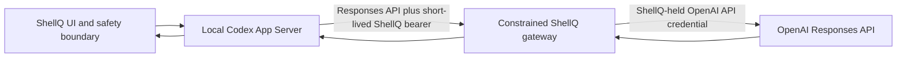

# ADR-0001: Subscription-first providers and optional cloud credits

- Status: Accepted
- Date: 2026-08-15
- Scope: Product and provider architecture; no current behavior change

## Context

ShellQ's useful product boundary is not a unique Ask/Command/Fix interface. Its
advantage is a small, review-only shell layer that can use the coding-agent
harness a user already installed and authenticated while preserving exact shell
failure context and a hard never-auto-execute boundary.

The current local pilot bundles Codex and Claude adapters. Codex App Server is
the default Codex engine. Each adapter uses the installed provider's supported
authentication, which may be backed by an existing user subscription or another
provider-supported billing method. ShellQ does not read, copy, proxy, print, or
store those credentials. There is currently no ShellQ cloud service, account,
billing, first-class BYOK setup, or Zero Data Retention (ZDR) offering.

ShellQ is intended to remain free, open source, and useful without a ShellQ
account. A paid service may remove setup friction, but must remain optional and
must not displace local provider authentication as the default.

## Decision

### 1. Reuse first-party harnesses by default

ShellQ will remain harness-first and subscription-first:

- Prefer an authenticated installed Codex or Claude CLI and its native agent
  runtime, provider-supported authentication, conversation state, streaming,
  and approval machinery.
- Keep ShellQ responsible only for shell lifecycle/context, the compact UI,
  request shaping, response validation, and the execution boundary.
- Do not build a general ShellQ agent, tool framework, transcript service, or
  model runtime. Upstream harness improvements should benefit ShellQ through
  thin adapters.
- Never promise that a CLI invocation is included in a subscription. The
  provider controls authentication, entitlement, quotas, models, and billing.

BYOK remains an optional future path. It should prefer provider-supported local
credential mechanisms and must not require ShellQ to store a provider API key
in its normal settings or cloud account.

### 2. Keep the safety boundary provider-independent

Every local, BYOK, or cloud-credit path must preserve the current invariants:

- Ask is read-only and never changes the shell buffer.
- Command and Fix accept only a validated, completed final response.
- Preview output is non-authoritative.
- A generated command may be inserted into `BUFFER` for review but is never
  auto-executed.
- Opening the UI or changing a provider, model, or effort starts no inference
  request.

### 3. Make ShellQ Cloud optional prepaid infrastructure, not an agent host

If ShellQ Cloud credits are implemented, selecting them will use this default
flow:

- Codex App Server stays on the user's machine. The gateway is not a public or
  server-side Codex agent and receives no authority to inspect or mutate the
  user's machine.
- ShellQ may use a compatible installed Codex binary with an isolated,
  ShellQ-managed `CODEX_HOME`. If Codex is missing or incompatible, ShellQ may
  explicitly offer to install a pinned managed runtime. It must not silently
  install software or modify the user's global Codex installation,
  authentication, history, MCPs, hooks, plugins, or configuration.
- The local App Server uses a Responses-compatible custom provider and obtains
  a short-lived ShellQ bearer through a local credential helper. An OpenAI API
  key is never shipped to the client. Detailed account, refresh-token, and
  billing mechanics remain undecided.
- The gateway treats the client as untrusted. It authenticates the ShellQ
  account, enforces balance, rate, spend, route, model, token, request-field,
  and tool limits, forces non-stored Responses requests, disallows background
  mode, avoids prompt/response body logs, streams the result, and meters actual
  usage.
- Cloud credits are opt-in. ShellQ must never silently fall back from installed
  provider authentication or BYOK to a paid ShellQ request.

This preserves the strongest part of the product: Codex remains the maintained
agent harness while ShellQ Cloud supplies only constrained inference, account,
and metering infrastructure.

## Current and future boundary

| Capability | Status after this ADR |
|---|---|
| Installed Codex/Claude harness and authentication reuse | Current local pilot |
| Read-only Ask, validated Command/Fix, insert-only commands | Current contract |
| First-class BYOK setup | Accepted direction; not implemented |
| ShellQ accounts, prepaid credits, gateway, or billing | Accepted direction; not implemented |
| ShellQ-managed isolated Codex runtime | Cloud design; not implemented |
| ZDR or no-cloud-retention service claim | Not offered; requires approval and proof |

Pricing, supported cloud models, credit expiry/refunds, payment provider,
service-level commitments, regional availability, and exact identity/token
design are deliberately undecided. They require evidence from a disposable
vertical slice and separate product decisions.

## Privacy and security consequences

"Local-first" describes where the shell integration and agent harness run; it
does not mean inference is on-device. A cloud-credit request sends selected
request content through ShellQ Cloud to OpenAI. Provider-owned local history may
also remain on the user's machine.

ShellQ may claim ZDR or "no cloud retention" only after all of the following are
true:

1. OpenAI has approved the exact ShellQ API organization or project for ZDR.
2. Every enabled endpoint, model, tool, caching mode, and capability is audited
   for ZDR eligibility and retention exceptions.
3. The gateway forces the required request policy, including `store: false` and
   no background mode.
4. ShellQ's gateway, logs, traces, metrics, queues, error reporting, support
   tooling, backups, and subprocesses have been verified not to retain customer
   prompts or model outputs.
5. Product wording distinguishes no cloud retention from local provider history
   and from data processed transiently to serve the request.

`store: false` alone is not a ZDR service and must never be marketed as one.

## Alternatives considered

1. **Local first-party harnesses plus optional BYOK and an optional cloud gateway — chosen.**
   This reuses existing authentication and maintained agent runtimes while
   keeping ShellQ small and preserving a free local product.
2. **A direct Responses API client as the default — rejected.** It would
   duplicate streaming, continuation, approval, tool, and agent-runtime work and
   would make API-key billing the default. It may be reconsidered only as a
   narrow compatibility fallback if the local App Server proves impractical on
   measured target machines.
3. **Codex App Server hosted by ShellQ — rejected.** A server-side agent would
   move the harness and its trust boundary into ShellQ infrastructure, create a
   much larger isolation problem, and lose the value of local shell context.
4. **A ShellQ-built agent and tool harness — rejected.** It would recreate the
   part that Codex and Claude already maintain and turn provider improvements
   into ShellQ maintenance work.

## Consequences

Benefits:

- Existing users can receive value from authentication and subscriptions they
  already maintain instead of needing another paid inference provider.
- ShellQ can focus on quick Ask/Command/Fix interaction, exact failure context,
  validation, and safe insertion rather than general agent infrastructure.
- Upstream providers own fast-moving model, conversation, and harness behavior.
- A future cloud service can offer a simpler paid path without making an account
  or ShellQ-hosted inference mandatory.

Costs and risks:

- ShellQ depends on evolving Codex and Claude CLI/App Server contracts.
- Subscription access, limits, and pricing remain outside ShellQ's control.
- A cloud service still creates material identity, metering, abuse, privacy,
  support, and operational obligations even though it does not host the agent.
- A managed Codex runtime adds installation, update, rollback, compatibility,
  and local-storage responsibilities.

## Implementation and revisit gates

This ADR authorizes direction, not implementation. Before user-visible BYOK or
ShellQ Cloud work:

1. Create the governing OpenSpec change for the observable workflow and safety
   boundary.
2. Build the smallest disposable end-to-end proof: one Ask and one Command
   through the selected path. For BYOK, use provider-supported local credentials
   without requiring a ShellQ account or gateway. For ShellQ Cloud, use a local
   App Server, short-lived ShellQ authentication, and a minimal
   Responses-compatible gateway, with no client OpenAI key or prompt retention.
3. Prove the real integration before building broad account, billing, model,
   installer, or operations surfaces.

Revisit this decision if App Server or custom-provider support changes, a
material target environment cannot afford the local runtime, provider terms no
longer permit the intended paths, ZDR requirements invalidate the gateway, or
maintaining thin adapters becomes comparable to maintaining a harness.

## Official sources

Accessed 2026-08-15; links and the cited capabilities rechecked against official
documentation on 2026-09-09. Documentation support is not a live ShellQ Cloud
integration or retention guarantee:

- [Codex App Server](https://learn.chatgpt.com/docs/app-server) documents App
  Server as the interface for embedding Codex in products, including
  authentication, conversation history, approvals, and streamed agent events.
- [Codex advanced configuration](https://learn.chatgpt.com/docs/config-file/config-advanced)
  documents custom provider `base_url`, the Responses wire API, and
  command-backed bearer authentication.
- [OpenAI data controls](https://developers.openai.com/api/docs/guides/your-data)
  documents ZDR approval requirements, forced non-storage for Responses under
  ZDR, and capability-specific eligibility and retention limitations.
